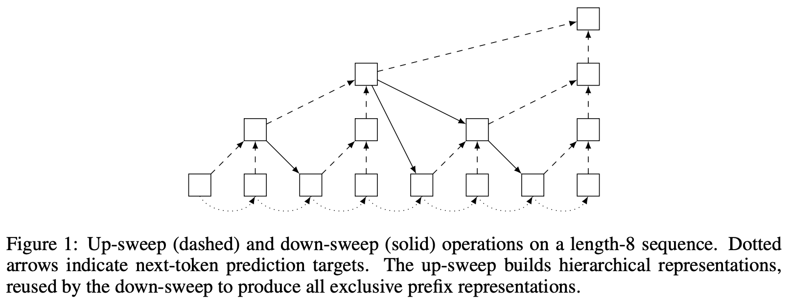

</img>

## Log Depth Recurrent Modeling - Pytorch

Explorations into the [Log Depth Recurrent Modeling](https://arxiv.org/abs/2609.28212) proposed by Yiqin Wang of Imperial College London.

## Install

```bash
$ pip install log-depth-recurrent-modeling
```

## Usage

```python
import torch
from log_depth_recurrent_modeling import ARGRC

model = ARGRC(
    num_tokens = 256,
    dim = 128,
    depth = 2,
    max_seq_len = 65536,
    shift_tokens = True
)

tokens = torch.randint(0, 256, (1, 65535))

# autoregressive loss

loss = model(tokens, return_loss = True)
loss.backward()

# forward for logits

logits = model(tokens) # (1, 65535, 256)
```

Standalone `ARGRCLayer`, which automatically pads the sequence to a multiple of `max_seq_len` (or the next power of two if unset) and strips the padding from the output:

```python
import torch
from log_depth_recurrent_modeling import ARGRCLayer

layer = ARGRCLayer(
    dim = 128,
    max_seq_len = 65536,
    prenorm = True,
    shift_tokens = True,
    separate_grc = False # shares up and down gated recursive cell
)

x = torch.randn(1, 65535, 128)

out = layer(x) + x # (1, 65535, 128)
```

Feed the sequence in chunks of varying length, carrying memory across calls (equivalent to one pass over the full sequence):

```python
memory = None

for start, length in ((0, 3), (3, 5), (8, 2)):
    chunk = x[:, start : start + length]
    out, memory = layer(chunk, memory = memory, return_memory = True)
```

## Tasks

Run parity task with length generalization:

```bash
$ python train_parity_extrapolation.py
```

Run character language modeling on enwik8 with memory caching during generation:

```bash
$ python train_enwik8.py
```

## Citations

```bibtex
@misc{wang2026logdepthrecurrentlanguagemodeling,
    title    = {Log-Depth Recurrent Language Modeling},
    author   = {Yiqin Wang and Nuri Cingillioglu and Charles Pert},
    year     = {2026},
    eprint   = {2609.28212},
    archivePrefix = {arXiv},
    primaryClass = {cs.LG},
    url      = {https://arxiv.org/abs/2609.28212},
}
```

```bibtex
@misc{shen2019orderedmemory,
    title   = {Ordered Memory},
    author  = {Yikang Shen and Shawn Tan and Arian Hosseini and Zhouhan Lin and Alessandro Sordoni and Aaron Courville},
    year    = {2019},
    eprint  = {1910.13466},
    archivePrefix = {arXiv},
    primaryClass = {cs.LG},
    url     = {https://arxiv.org/abs/1910.13466},
}
```

```bibtex
@misc{pert2026lengthgeneralizationlogdepthrecurrent,
    title     = {Length Generalization with Log-Depth Recurrent Units},
    author    = {Charles Pert and Dalal Alrajeh and Alessandra Russo},
    year      = {2026},
    eprint    = {2605.26035},
    archivePrefix = {arXiv},
    primaryClass = {cs.LG},
    url       = {https://arxiv.org/abs/2605.26035},
}
```

```bibtex
@software{peng_bo_2021_5196578,
    author    = {PENG Bo},
    title     = {BlinkDL/RWKV-LM: 0.01},
    month     = {aug},
    year      = {2021},
    publisher = {Zenodo},
    version   = {0.01},
    doi       = {10.5281/zenodo.5196578},
    url       = {https://doi.org/10.5281/zenodo.5196578}
}
```
